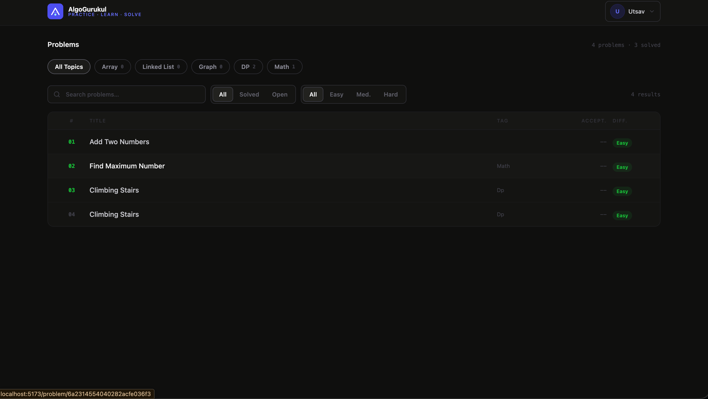
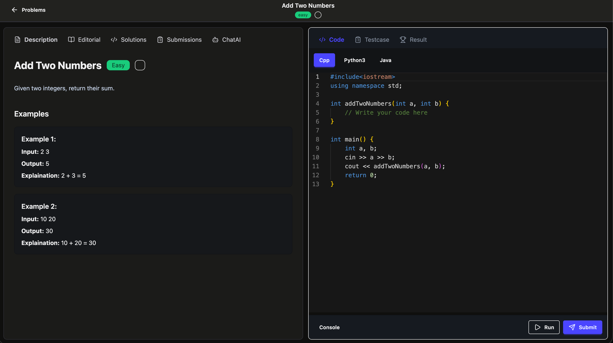
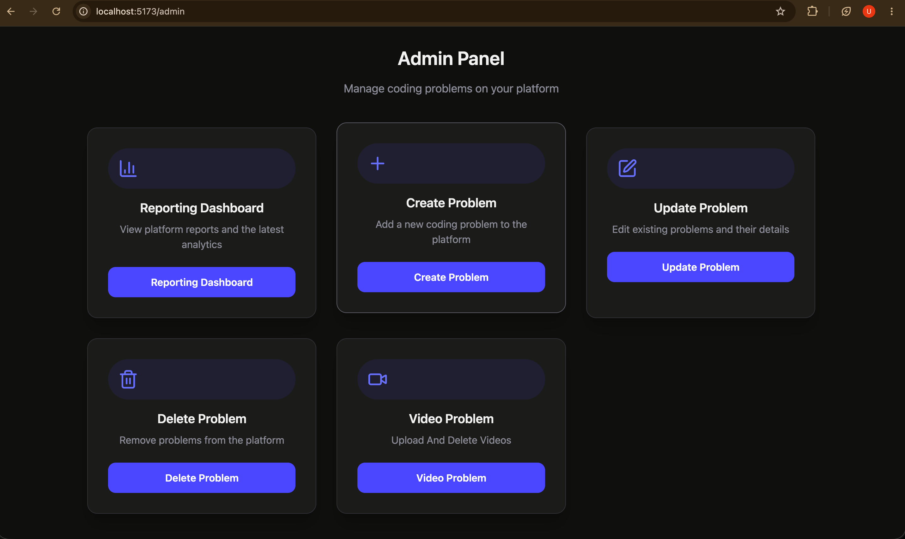

# System Architecture

```text
┌─────────────────┐
│     Client      │
│ React + Redux   │
└────────┬────────┘
         │ HTTP Requests
         ▼
┌─────────────────┐
│ Express Backend │
│ Authentication  │
│ Problem APIs    │
│ Submission APIs │
│ AI APIs         │
└───────┬─────────┘
        │
 ┌──────┼─────────────┐
 ▼      ▼             ▼
MongoDB Redis     Judge0
(Database) Cache  Code Execution

        │
        ▼
   Cloudinary
(Video Storage)

        │
        ▼
 Google Gemini
    AI APIs
```

# Workflow

## User Workflow

1. User registers or logs in.
2. JWT token is generated and stored in secure cookies.
3. User browses coding problems.
4. User writes code and submits solution.
5. Backend sends code to Judge0.
6. Judge0 executes code and returns result.
7. Submission is stored in MongoDB.
8. User can view submission history and progress.

## Admin Workflow

1. Admin logs in.
2. Admin accesses admin dashboard.
3. Admin creates, updates, or deletes problems.
4. Changes are stored in MongoDB.
5. Updated problems become available to all users.

## AI Workflow

1. User sends prompt.
2. Backend forwards request to Gemini API.
3. Gemini generates response.
4. Response is returned to frontend.

# Database Design

## User Collection

```javascript
{
  _id,
  firstName,
  lastName,
  emailId,
  password,
  role
}
```

## Problem Collection

```javascript
{
  _id,
  title,
  description,
  difficulty,
  tags,
  testCases
}
```

## Submission Collection

```javascript
{
  _id,
  userId,
  problemId,
  code,
  language,
  verdict,
  executionTime
}
```

<h1>📸 Screenshots</h1>

<p align="center">
  
  
</p>

<p align="center">
  
</p>

# Future Improvements

* Contest System
* Company-wise Problem Sheets
* Discussion Forum
* Leaderboard
* Real-Time Collaborative Coding
* AI Code Review
* AI Interview Preparation
* Video Learning Platform

# Author

**Utsav Kushwaha**

* GitHub: https://github.com/utsav-1511
* LinkedIn: https://linkedin.com/in/utsav-kushwaha/
